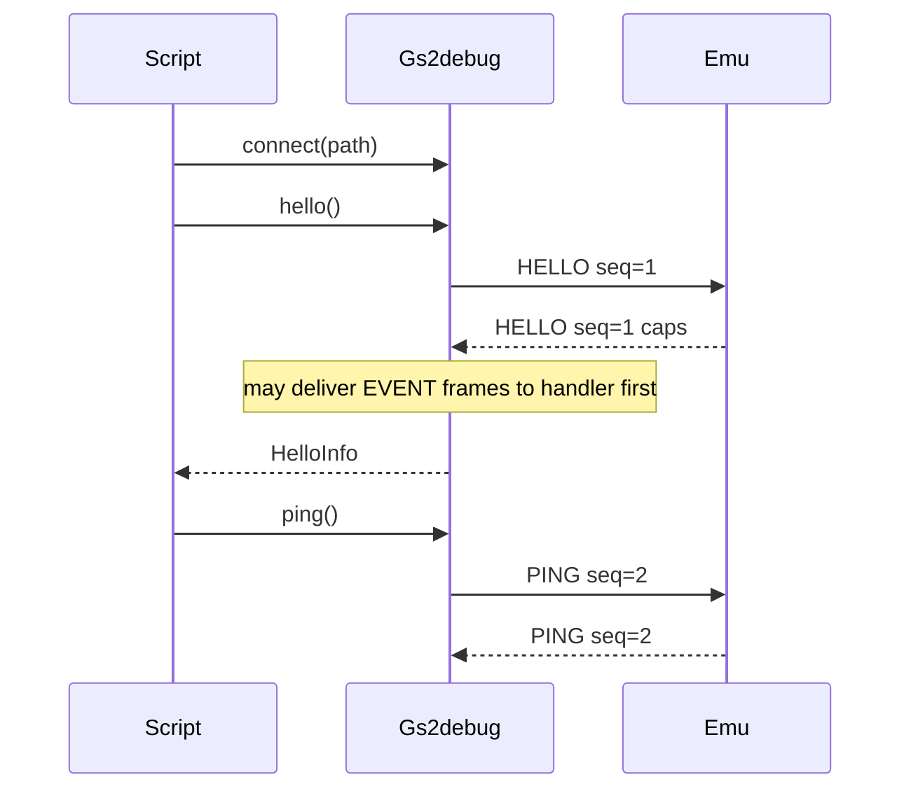

# External Debug Client (Sketch v1)

Host-side client library for [DebugProtocol.md](DebugProtocol.md). Wire format lives in the protocol doc; this document covers language choice, library shape, API, and client-side concerns so agents and scripts do not re-implement framing from scratch.

Python package lives under [`clients/python/`](../clients/python/) (`gs2debug`). Wire format: [DebugProtocol.md](DebugProtocol.md).

## Language: Python 3

**Python 3.10+** is the first (and primary) client language.

Why:

- Stdlib `socket` covers AF_UNIX (macOS / Linux) and TCP with no dependencies; Windows AF_UNIX works on recent Python + Windows 10+.
- Agents and CI scripts already default to Python; extending framing with `struct` / `socket` is straightforward.
- No build step — drop a script next to the package and call `Client`.
- Matches the protocol direction: host-driven tools, opaque binary on the wire, no JSON in the emulator.

A later TypeScript (or other) client can share the same wire rules from the protocol doc (e.g. for MCP). This sketch does not define those APIs.

You do not need deep Python experience to use the library; agents and the package own most of the protocol detail.

## Responsibilities

| Layer | Owns |
|-------|------|
| [DebugProtocol.md](DebugProtocol.md) | Frame bytes, type IDs, payload layouts |
| Client library (`gs2debug`) | Connect, framing read/write, seq allocation, HELLO, request/reply matching, ERROR → exception, EVENT demux |
| Agent / script | Workflows (pause → read → …), timeouts, retries, policy |

The emulator owns machine state. The client peeks/pokes memory via READMEM / WRITEMEM.

## Proposed package layout

```
clients/python/
  README.md
  pyproject.toml          # package name gs2debug, requires-python >= 3.10, no runtime deps
  src/gs2debug/
    __init__.py
    types.py              # HELLO / PING / ERROR / EVENT constants, main/sub helpers
    frame.py              # pack / unpack 12-byte header + payload
    client.py             # Client class
    errors.py             # ProtocolError from ERROR frames
  tests/
    test_frame.py         # encode/decode roundtrips (no socket server needed)
```

Stdlib only: `socket`, `struct`. Optional later: `threading` / `selectors` for a background event reader.

## Client API (v1 meta only)

```python
from collections.abc import Callable
from dataclasses import dataclass

@dataclass
class HelloInfo:
    version: int
    flags: int
    max_payload: int

class Client:
    def connect(self, path: str) -> None:
        """Connect to a Unix-domain socket at path. TCP later."""

    def close(self) -> None:
        """Close the connection."""

    def hello(self, version: int = 1) -> HelloInfo:
        """Send HELLO; return server caps. Required before other commands."""

    def ping(self) -> None:
        """Send PING; succeed if empty PING reply arrives."""

    def get_status(self) -> int:
        """Send GET_STATUS; return execution_mode (0=NORMAL, 1=STEP_INTO, 2=PAUSED).
        Handled on the emulator main thread."""

    def read_mem(self, domain: int, address: int, length: int) -> bytes:
        """Send READMEM; return `length` bytes from the given domain/address.
        Domain 0=MAIN (implemented). MEGAII/ENSONIQ/ADBMICRO reserved.
        Handled on the emulator main thread."""

    def write_mem(self, domain: int, address: int, data: bytes) -> None:
        """Send WRITEMEM; poke `data` at domain/address.
        Domain 0=MAIN (implemented). MEGAII/ENSONIQ/ADBMICRO reserved.
        Handled on the emulator main thread. Success reply is empty."""

    def key_event(self, down: bool, scancode: int, mod: int = 0) -> None:
        """Send KEYEVENT (one SDL key down or up)."""

    def key_down(self, scancode: int, mod: int = 0) -> None:
        """KEYEVENT down. Use for modifiers and low-level control."""

    def key_up(self, scancode: int, mod: int = 0) -> None:
        """KEYEVENT up."""

    def tap_key(self, scancode: int, mod: int = 0) -> None:
        """keydown then keyup with the same scancode/mod."""

    def type_text(self, text: str, *, delay_s: float = 0.05) -> None:
        """Type printable ASCII (US layout); newline → Return. Shift held per glyph as needed."""

    def request(
        self,
        type: int,
        payload: bytes = b"",
        *,
        timeout: float | None = None,
    ) -> bytes:
        """Send one request; return reply payload. Raises ProtocolError on ERROR."""

    def on_event(
        self,
        handler: Callable[[int, int, bytes], None] | None,
    ) -> None:
        """Register handler(event_id, seq, data) for EVENT frames. None clears."""
```

Generic `request` keeps payloads as `bytes`. Thin helpers (e.g. inside `hello`) pack/unpack documented fields with `struct` — no JSON.

### Behavioral rules

1. **Connect + HELLO first.** Any other command before a successful `hello()` is a client bug; server may reply `ERROR` with `E_NOT_HANDSHAKED`. Surface `E_BAD_VERSION` / `E_NOT_HANDSHAKED` as `ProtocolError`.
2. **Single-flight v1.** At most one outstanding `request` at a time. Library allocates monotone non-zero `seq` (start at 1).
3. **Reply matching.** After send, read frames until a non-`EVENT` frame with matching `seq`:
   - `type == ERROR` → raise `ProtocolError(code, message)`
   - `type` equals the request type → return payload
   - otherwise → protocol violation (raise)
4. **EVENT while waiting.** If an `EVENT` frame arrives before the reply, invoke `on_event` (or queue if no handler), then keep waiting for the reply. Events must not break request/reply pairing.
5. **Timeouts.** `request(..., timeout=seconds)` raises on deadline (e.g. `TimeoutError`). Connection failures raise clearly (`OSError` / library wrapper).
6. **Threading (v1).** Sync API on the caller thread is enough for HELLO/PING smoke tests. A background reader for events while idle is a later enhancement — not required here.

### Errors

```python
class ProtocolError(Exception):
    code: int       # E_* from the protocol doc
    message: str    # UTF-8 text from ERROR payload (may be empty)
```

Map known codes (`E_UNKNOWN_TYPE`, `E_BAD_LENGTH`, …) in docs or constants; agents can branch on `code`.

## Client-side concerns

Implementers and agents must handle these; do not reinvent per script:

| Concern | Rule |
|---------|------|
| Partial I/O | Loop `recv`/`send` until the full 12-byte header and `N` payload bytes are transferred |
| Endianness | Little-endian: `struct.pack("<III", type, seq, length)` / `unpack` |
| Max payload | 1 MiB (`0x00100000`). Refuse to send or accept larger frames |
| Connection model | One client connection; reconnect = new `Client` |
| Socket path | AF_UNIX path for now (e.g. `/tmp/gs2.sock`). Windows named pipes / TCP later |
| Unknown events | Ignore unknown `event_id` values (handler may no-op) |
| Encoding | No JSON. Payloads are `bytes`; helpers use `struct` for fixed fields |

## Smoke-test story

**Until the emulator socket exists:** unit-test `frame.py` encode/decode only.

**Once the debug socket exists:**

1. Start GSSquared with `--debug PATH` (or `-D PATH`).
2. `Client().connect(path)` → `hello()` → memory / `key_event` / `type_text` → `ping()`.
3. Assert caps; optionally Control-Reset (Ctrl+F12) then type BASIC on IIe (`-p 1`).

## Non-goals (this sketch)

- MCP wrapper, async API, pipelining, TCP connect
- High-level debug commands beyond HELLO / PING / GET_STATUS / READMEM / WRITEMEM / KEYEVENT (`pause`, …)

## Flow



# Example Commands

```
 PYTHONPATH=clients/python/src python3 clients/python/examples/hello_ping.py /tmp/gs2.sock
```
