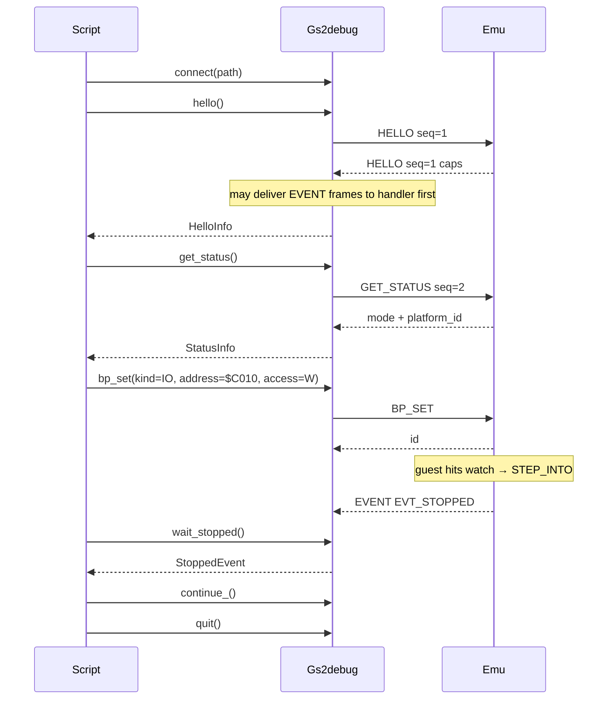

# External Debug Client

Host-side client library for [DebugProtocol.md](DebugProtocol.md). Wire format lives in the protocol doc; this document covers language choice, library shape, API, and client-side concerns so agents and scripts do not re-implement framing from scratch.

Python package lives under [`clients/python/`](../clients/python/) (`gs2debug`). Wire format: [DebugProtocol.md](DebugProtocol.md).

**Agent / script cookbook (preferred entry point):** [gs2debug.md](gs2debug.md).

## Language: Python 3

**Python 3.10+** is the first (and primary) client language.

Why:

- Stdlib `socket` covers AF_UNIX (macOS / Linux) and TCP with no dependencies; Windows AF_UNIX works on recent Python + Windows 10+.
- Agents and CI scripts already default to Python; extending framing with `struct` / `socket` is straightforward.
- No build step — drop a script next to the package and call `Client`.
- Matches the protocol direction: host-driven tools, opaque binary on the wire, no JSON in the emulator.

A later TypeScript (or other) client can share the same wire rules from the protocol doc (e.g. for MCP). This sketch does not define those APIs.

You do not need deep Python experience to use the library; agents and the package own most of the protocol detail.

## Responsibilities

| Layer | Owns |
|-------|------|
| [DebugProtocol.md](DebugProtocol.md) | Frame bytes, type IDs, payload layouts |
| Client library (`gs2debug`) | Connect, framing read/write, seq allocation, HELLO, request/reply matching, ERROR → exception, EVENT demux, thin helpers (`read_mem`, `reset`, `bp_set`, `wait_stopped`, `type_text`, `quit`, …) |
| Agent / script | Workflows (reset → type → peek → …), timeouts, retries, policy |

The emulator owns machine state. The client peeks/pokes memory via READMEM / WRITEMEM, resets via RESET, run-controls via PAUSE / CONTINUE, sets breakpoints via BP_*, injects keys via KEYEVENT, and force-exits via QUIT.

## Package layout

```
clients/python/
  README.md
  pyproject.toml          # package name gs2debug, requires-python >= 3.10, no runtime deps
  src/gs2debug/
    __init__.py
    types.py              # HELLO / PING / QUIT / GET_STATUS / RESET / PAUSE / CONTINUE /
                          # READMEM / WRITEMEM / BP_* / KEYEVENT / EVT_* / STOP_* / MEM_* constants
    keys.py               # SDL scancodes / keymods + ASCII→key map for type_text
    frame.py              # pack / unpack 12-byte header + payload
    client.py             # Client, HelloInfo, StatusInfo, BpInfo, StoppedEvent
    errors.py             # ProtocolError from ERROR frames
  examples/               # hello_ping, read/write text40, type_to_emu, test_breakpoints,
                          # watch_data_iigs, watch_c010_iie, …
  tests/
    test_frame.py         # encode/decode roundtrips (no socket server needed)
```

Stdlib only: `socket`, `struct`. Optional later: `threading` / `selectors` for a background event reader.

## Client API

```python
from collections.abc import Callable
from dataclasses import dataclass

@dataclass(frozen=True)
class HelloInfo:
    version: int
    flags: int
    max_payload: int

@dataclass(frozen=True)
class StatusInfo:
    execution_mode: int  # 0=NORMAL, 1=STEP_INTO, 2=PAUSED
    platform_id: int     # PlatformId_t / -p N (0=II … 5=IIgs)

@dataclass(frozen=True)
class BpInfo:
    id: int
    hit_count: int
    kind: int            # BP_KIND_EXEC / DATA / IO
    flags: int
    access: int          # BP_ACCESS_*
    domain: int
    address: int
    length: int
    addr_mask: int
    data_value: int
    data_mask: int
    ignore_count: int

@dataclass(frozen=True)
class StoppedEvent:
    reason: int          # STOP_BP_EXEC / DATA / IO / STOP_STEP / STOP_PAUSE
    bp_id: int
    pc: int
    eaddr: int
    value: int
    access: int
    kind: int
    execution_mode: int
    trace: bytes         # 40-byte system_trace_entry_t snapshot when present

class Client:
    def connect(self, path: str) -> None:
        """Connect to a Unix-domain socket at path. TCP later."""

    def close(self) -> None:
        """Close the connection."""

    def hello(self, version: int = 1) -> HelloInfo:
        """Send HELLO; return server caps. Required before other commands."""

    def ping(self) -> None:
        """Send PING; succeed if empty PING reply arrives."""

    def quit(self) -> None:
        """Force-quit emulator (skips QuitModal / dirty-disk prompts).
        Prefer over kill/SIGTERM. If a harness must SIGTERM, start GSSquared
        with --no-quit-confirm."""

    def get_status(self) -> StatusInfo:
        """Send GET_STATUS; return execution_mode and platform_id.
        Handled on the emulator main thread. Reply is 8 bytes on the wire."""

    def reset(self, cold_start: bool = False) -> None:
        """Send RESET; call computer_t::reset(cold_start) on the main thread.
        cold_start=True clears $3F2–$3F4 before reset. Does not clear breakpoints."""

    def pause(self) -> None:
        """PAUSE: stop guest execution (STOP_PAUSE / EXEC_PAUSED)."""

    def continue_(self) -> None:
        """CONTINUE: resume from PAUSE or STEP_INTO (EXEC_NORMAL)."""

    def step_into(self, count: int = 1) -> None:
        """STEP_INTO: run `count` instructions (instructions_left); empty reply.
        When the batch finishes: EVT_STOPPED STOP_STEP + CPU trace. count >= 1."""

    def bp_set(
        self,
        *,
        kind: int,
        address: int,
        length: int = 1,
        flags: int = BP_FLAG_ENABLED,
        access: int = BP_ACCESS_NONE,
        domain: int = 0,
        addr_mask: int = 0xFFFFFFFF,
        data_value: int = 0,
        data_mask: int = 0xFF,
        ignore_count: int = 0,
    ) -> int:
        """BP_SET; return new breakpoint id. See DebugProtocol.md for kind/access rules.
        EXEC: access ignored. DATA/IO: access R/W/RW required. IO: $C000–$C0FF offset."""

    def bp_clear(self, bp_id: int) -> None:
        """BP_CLEAR one id."""

    def bp_clear_all(self) -> None:
        """BP_CLEAR_ALL (shared table with the built-in debugger)."""

    def bp_enable(self, bp_id: int, enabled: bool = True) -> None:
        """BP_ENABLE / disable by id."""

    def bp_list(self) -> list[BpInfo]:
        """BP_LIST; return current table entries."""

    def wait_event(self, *, timeout: float | None = 5.0) -> tuple[int, int, bytes]:
        """Block until an EVENT frame. Returns (event_id, seq, data).
        Raises TimeoutError on deadline. Cannot run while a request is outstanding."""

    def wait_stopped(self, *, timeout: float | None = 5.0) -> StoppedEvent:
        """Block until EVT_STOPPED; parse and return StoppedEvent.
        Skips other event ids (e.g. EVT_RUN_STATE) until a stop arrives."""

    def read_mem(self, domain: int, address: int, length: int) -> bytes:
        """Send READMEM; return `length` bytes from the given domain/address.
        Domains: MAIN, MAIN_RAW; MEGAII / MEGAII_RAW on Apple IIgs.
        ENSONIQ/ADBMICRO reserved. Handled on the emulator main thread."""

    def write_mem(self, domain: int, address: int, data: bytes) -> None:
        """Send WRITEMEM; poke `data` at domain/address.
        Domains: MAIN, MAIN_RAW; MEGAII / MEGAII_RAW on Apple IIgs.
        ENSONIQ/ADBMICRO reserved. Handled on the emulator main thread. Success reply is empty."""

    def key_event(self, down: bool, scancode: int, mod: int = 0) -> None:
        """Send KEYEVENT (one SDL key down or up)."""

    def key_down(self, scancode: int, mod: int = 0) -> None:
        """KEYEVENT down. Use for modifiers and low-level control."""

    def key_up(self, scancode: int, mod: int = 0) -> None:
        """KEYEVENT up."""

    def tap_key(self, scancode: int, mod: int = 0, *, hold_s: float = 0.02) -> None:
        """keydown, optional hold, then keyup with the same scancode/mod."""

    def type_text(self, text: str, *, delay_s: float = 0.05, hold_s: float = 0.02) -> None:
        """Type printable ASCII (US layout); newline → Return.
        hold_s between down/up; delay_s after each char (3× after Return)."""

    def request(
        self,
        type: int,
        payload: bytes = b"",
        *,
        timeout: float | None = None,
    ) -> bytes:
        """Send one request; return reply payload. Raises ProtocolError on ERROR."""

    def on_event(
        self,
        handler: Callable[[int, int, bytes], None] | None,
    ) -> None:
        """Register handler(event_id, seq, data) for EVENT frames. None clears.
        Also invoked for EVENTs interleaved while a request awaits its reply."""
```

Generic `request` keeps payloads as `bytes`. Thin helpers pack/unpack documented fields with `struct` — no JSON.

Constants (`BP_KIND_*`, `BP_ACCESS_*`, `BP_FLAG_*`, `EVT_*`, `STOP_*`, `EXEC_*`, `MEM_*`, `PLATFORM_*`) are re-exported from `gs2debug` / `gs2debug.types`. Breakpoint semantics: [DebugProtocol.md](DebugProtocol.md) (EXEC / DATA / IO, masks, ignore_count, STOP reasons).

### Behavioral rules

1. **Connect + HELLO first.** Any other command before a successful `hello()` is a client bug; server may reply `ERROR` with `E_NOT_HANDSHAKED`. Surface `E_BAD_VERSION` / `E_NOT_HANDSHAKED` as `ProtocolError`.
2. **Single-flight v1.** At most one outstanding `request` at a time. Library allocates monotone non-zero `seq` (start at 1). `wait_event` / `wait_stopped` also require no outstanding request.
3. **Reply matching.** After send, read frames until a non-`EVENT` frame with matching `seq`:
   - `type == ERROR` → raise `ProtocolError(code, message)`
   - `type` equals the request type → return payload
   - otherwise → protocol violation (raise)
4. **EVENT while waiting.** If an `EVENT` frame arrives before the reply, invoke `on_event` (if set), then keep waiting for the reply. Events must not break request/reply pairing. Prefer `wait_stopped()` when idle for stop notifications.
5. **Timeouts.** `request(..., timeout=seconds)` / `wait_event` / `wait_stopped` raise `TimeoutError` on deadline. Connection failures raise clearly (`OSError`).
6. **Threading (v1).** Sync API on the caller thread. A background reader for events while idle is a later enhancement.
7. **Breakpoint hit → STEP_INTO.** A DATA/IO/EXEC hit (and PAUSE) leaves the emu in `EXEC_STEP_INTO` or `EXEC_PAUSED` until `continue_()` or `step_into(n)`. Scripts that want a visible pause must delay before resume. `step_into(n)` arms N instructions and delivers `STOP_STEP` when done.
8. **Quit cleanly.** Prefer `quit()` over killing the process (SDL maps SIGTERM to QuitModal unless `--no-quit-confirm`).

### Errors

```python
class ProtocolError(Exception):
    code: int       # E_* from the protocol doc
    message: str    # UTF-8 text from ERROR payload (may be empty)
```

Map known codes (`E_UNKNOWN_TYPE`, `E_BAD_LENGTH`, …) in docs or constants; agents can branch on `code`.

## Client-side concerns

Implementers and agents must handle these; do not reinvent per script:

| Concern | Rule |
|---------|------|
| Partial I/O | Loop `recv`/`send` until the full 12-byte header and `N` payload bytes are transferred |
| Endianness | Little-endian: `struct.pack("<III", type, seq, length)` / `unpack` |
| Max payload | 1 MiB (`0x00100000`). Refuse to send or accept larger frames |
| Connection model | One client connection; reconnect = new `Client` |
| Socket path | AF_UNIX path for now (e.g. `/tmp/gs2.sock`). Windows named pipes / TCP later |
| Unknown events | Ignore unknown `event_id` values (handler may no-op); `wait_stopped` skips non-`EVT_STOPPED` |
| Encoding | No JSON. Payloads are `bytes`; helpers use `struct` for fixed fields |

## Smoke-test story

**Until the emulator socket exists:** unit-test `frame.py` encode/decode only.

**Once the debug socket exists:**

1. Start GSSquared with `--debug PATH` (or `-D PATH`), e.g. `-p 3` for IIe Enhanced / `-p 5` for IIgs.
2. `Client().connect(path)` → `hello()` → `get_status()` (check `platform_id`) → `reset()` / `read_mem` / `type_text` / `bp_*` / `wait_stopped` → `quit()`.
3. Assert caps and that `platform_id` matches the launched `-p N`.
4. Prefer `c.quit()` over `kill` (see [AGENTS.md](../AGENTS.md) debug-protocol smoke notes).

**Self-launching examples** (spawn GSSquared, exercise protocol, quit):

| Script | Role |
|--------|------|
| `examples/test_breakpoints.py` | PAUSE/CONTINUE + EXEC/IO + cap (expects running emu + socket args) |
| `examples/watch_data_iigs.py` | Launch `-p 5`, DATA watch, print stop packet, QUIT |
| `examples/watch_c010_iie.py` | Launch `-p 3`, IO write `$C010`, hold in STEP, CONTINUE, QUIT |

## Non-goals (v1 client)

- MCP wrapper, async API, pipelining, TCP connect
- Expression-language breakpoints (host owns policy; emu is typed stops only)

## Flow



# Example Commands

```
./build/GSSquared --debug /tmp/gs2.sock -p 3
PYTHONPATH=clients/python/src python3 clients/python/examples/hello_ping.py /tmp/gs2.sock

PYTHONPATH=clients/python/src python3 clients/python/examples/watch_c010_iie.py
PYTHONPATH=clients/python/src python3 clients/python/examples/watch_data_iigs.py 02/0000
```
