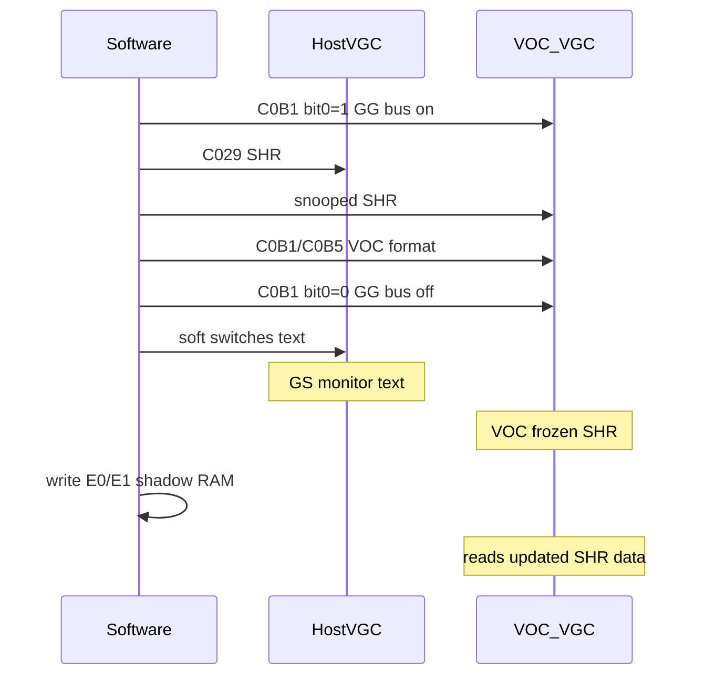
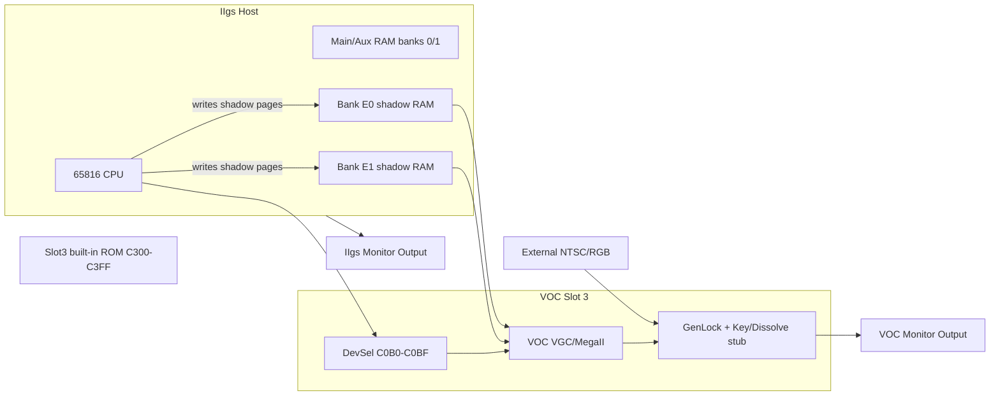

# Apple II Video Overlay Card (VOC) — Cleanroom Specification

This document describes the Apple IIgs Video Overlay Card (VOC) as inferred from
the KEGS emulator implementation and related public material. It is intended as
a cleanroom hardware specification for implementers.

**Sources:** [`src/voc.c`](../src/voc.c), [`src/moremem.c`](../src/moremem.c),
[`src/video.c`](../src/video.c), [`doc/README.kegs.txt`](README.kegs.txt).
Register bit names and overlay/genlock semantics come from inline comments in
`voc.c` (attributed in KEGS to VOC development headers and public material).

**Legend:**

| Label | Meaning |
|-------|---------|
| **Implemented in KEGS** | Behavior observable in KEGS source |
| **Register-defined** | Register exists and is stored; pixel/video effect not emulated |
| **Inferred** | Derived from architecture or comments; not verified in KEGS |

---

## 1. Overview

The VOC is a slot-3 expansion card with its own **complete Mega II/VGC graphics
subsystem**. On real hardware it can render **any Apple II/IIgs graphics mode**
(lores, hires, double-hires, text, SHR) to the VOC monitor output, with
genlock/overlay compositing over external video.

**Implemented in KEGS:** VOC display changes apply to **SHR only** — 640×400
interlace mode and main-memory SHR source. VOC registers are stored but do not
affect lores/hires/text rendering paths.

A VOC-specific extension exploited by software is **640×400 SHR** using dual
shadow banks `$E0` and `$E1`. The hardware register name for this mode is
**interlace mode**; the KEGS implementation target is **progressive 60 Hz**
(see §5.4).

KEGS enables the card via config flag `g_voc_enable` rather than hardware
auto-detection (see §6).

### 1.1 Real Hardware vs KEGS Scope

| Capability | Real VOC | KEGS |
|------------|----------|------|
| Lores, hires, DHR, text on VOC output | Yes (independent Mega II/VGC) | No VOC-specific path |
| SHR on VOC output | Yes | Yes (standard aux source) |
| SHR main-memory source (`$C0B1` 5:4=`01`) | Yes | Yes (`ALL_STAT_VOC_MAIN`) |
| SHR 640×400 interlace mode | Yes (30 Hz fields) | Yes, progressive 60 Hz (`ALL_STAT_VOC_INTERLACE`) |
| Video overlay / genlock compositing | Yes | Stub (registers only) |
| Independent VOC vs GS video mode | Partial (see §1.2) | No — fully mirrored |

KEGS gates VOC display flags inside `video_all_stat_to_filt_stat` — they apply
**only when `ALL_STAT_SUPER_HIRES` is set** (`video.c` lines 722–724). The
`voc.c` header states: *"The only currently supported VOC feature is the SHR
interlaced display."*

### 1.2 Mode Coupling: VOC vs IIgs

**Inferred:** The VOC is **not a simple mirror** of GS video mode at all times.
Mode coupling is **partial**, through the GG bus, with VOC-specific overrides.

**Separate outputs:** The IIgs host VGC drives the GS monitor; the VOC's own
Mega II/VGC drives the VOC monitor. Apple IIgs Technical Note #70 states that
host `$C02E`/`$C02F` counters are **not synchronous** with VOC video output —
separate scan domains.

**Shared base mode (GG Bus Enable = 1, `$C0B1` bit 0):** **Inferred:** VOC
observes host video soft-switch writes — at minimum `$C023` (KEGS comment:
"ignores writes to `$C023`, etc." when bit 0 = 0). This implies the VOC VGC
snoops host `$C029` / `$C050`–`$C057` class registers for base mode selection
(text, lores, hires, SHR). Init sequences set `$C029` for SHR alongside VOC
registers.

**VOC-only overrides (independent of host display formatting):**

| Control | Register | Effect on VOC output only |
|---------|----------|---------------------------|
| SHR memory source | `$C0B1` 5:4 | Aux vs main vs interlaced bank selection |
| VOC linearization | `$C0B1` bit 3 (MainPageLin) | Separate from host `$C029` bit 6 |
| Interlace 640×400 | `$C0B1` 5:4=`11` + `$C0B5` bit 7 | VOC output path only |
| Overlay/genlock | `$C0B3`–`$C0B5` | VOC compositor only |

**Register-defined:** Clearing `$C0B1` bit 3 (e.g. write `$30`) stops VOC-side
memory linearization; the SHR buffer appears scrambled until re-enabled, even if
host `$C029` bit 6 remains set.

**GG Bus disabled (`$C0B1` bit 0 = 0):** **Inferred:** VOC ignores host video
I/O writes. Exact latched-mode behavior is not documented in KEGS.

**Practical model:**

- **Memory:** Always shared via `$E0`/`$E1` shadow — both subsystems read the
  same framebuffer data.
- **Base mode:** Coupled when GG bus enabled; typical software keeps host and
  VOC in the same base mode.
- **Output format:** VOC can extend SHR with interlace, alternate bank source,
  and overlay. The GS monitor may show 320×200 SHR while the VOC monitor shows
  640×400 interlaced SHR of the same shadow memory.
- **Full independence** (GS text + VOC hires simultaneously): architecturally
  plausible (separate VGC chips) but **not confirmed** in KEGS.

**Implemented in KEGS:** Single display, single `g_cur_a2_stat`. VOC register
changes patch host display state directly (`voc_update_interlace` →
`change_display_mode`). Fully mirrored — no independent VOC video mode.

### 1.3 Decoupled Mode Programming

**Inferred technique** — not implemented or tested in KEGS.

Software *may* achieve **VOC in SHR while the GS shows text** by toggling
**GG Bus Enable** (`$C0B1` bit 0).

**Terminology:**

| Term | Register | Purpose |
|------|----------|---------|
| **GG Bus Enable** | `$C0B1` bit 0 | VOC snoops (or ignores) host video soft-switch writes |
| **Memory shadow** | `$C035` + `$E0`/`$E1` banks | CPU writes to shadowed pages land in VOC framebuffer RAM — **independent of GG bus** |

Do not conflate GG bus with `$C035` shadowing. SHR framebuffer updates via bank
`$E0`/`$E1` (or aux/main shadow pages) work **regardless of GG bus state**.

**Proposed decoupling sequence:**

```
1. $C0B1 bit 0 ← 1          ; GG bus ON — VOC follows host video I/O
2. $C029 ← SHR              ; Both GS and VOC enter SHR
3. $C0B1/$C0B5 ← VOC opts   ; Interlace, MainPageLin, etc.
4. $C0B1 bit 0 ← 0          ; GG bus OFF — VOC freezes latched mode
5. soft switches ← text     ; GS monitor → text; VOC stays SHR (inferred)
6. Write SHR data to $E0/$E1 ; No GG bus needed for memory updates
```

**Important:** Re-enabling GG bus while the host is in text mode may re-sync
VOC to text, undoing decoupling. Keep GG bus **disabled** during normal
operation when modes must differ.

**Unverified caveats:**

- Whether VOC **latches** base mode on GG bus falling edge vs simply stops
  receiving updates.
- Host `$C023` scan interrupts may not align with VOC beam when GG bus is off;
  use `$C0B0` for VOC timing (per TN #70).



### 1.4 Architecture



---

## 2. Slot and I/O Map

**No VOC-specific `$CNxx` ROM.** The VOC occupies slot 3 but does not provide
card firmware in the `$C300`–`$C3FF` I/O-select range. That range remains the
**IIgs built-in slot 3 ROM** (80-column firmware), served by `c3xx_read` in
`moremem.c` from `g_rom_fc_ff_ptr[0x3c300+]`. VOC control is exclusively via
**device-select** registers at `$C0B0`–`$C0BF`.

| Region | Address Range | Owner | Function | KEGS |
|--------|---------------|-------|----------|------|
| Device Select (slot 3) | `$C0B0`–`$C0BF` | VOC | Control/status registers | Implemented |
| I/O Select (slot 3) | `$C300`–`$C3FF` | IIgs firmware | Built-in slot 3 ROM (80-col) | Standard ROM path |

**Related host registers (not VOC-owned, required for SHR):**

| Register | Address | Role |
|----------|---------|------|
| New Video | `$C029` | Bit 7 = SHR enable; bit 6 = host-side memory linearization |
| Shadow | `$C035` | Controls which host pages shadow into `$E0`/`$E1` |
| Scan/video IRQ | `$C023` | VGC scan-line and 1-second interrupts; gated by `$C0B1` bit 0 |

Per Apple TN #70: host Mega II counters at `$C02E`/`$C02F` synchronize to
IIgs video, **not** VOC video output. Use VOC status register `$C0B0` for
VOC-output beam timing.

---

## 3. Device-Select Registers (`$C0B0`–`$C0BF`)

All registers below are accessed via slot 3 device select. Unlisted offsets
within `$C0B0`–`$C0BF` are undocumented in KEGS.

### `$C0B0` — Status / VBL Acknowledge

**Read (R/O when VOC enabled):**

| Bit | Name | Meaning |
|-----|------|---------|
| 2 | InVBL | 1 = in vertical blanking |
| 3 | VideoDetected | 1 = external video detected |
| 4 | GenLocked | 1 = video genlocked |
| 5 | Field | 0 = field 0, 1 = field 1 |
| 6 | VBLIntPending | VBL interrupt request pending |
| 7 | LineIntPending | Line interrupt request pending |

**Implemented in KEGS:** Bits 2 and 5 computed from host VBL state
(`voc_read_reg0`). Bits 3–4, 6–7 not fully modeled.

**Write:** Write `$00` to clear VBL interrupt. Other write values are invalid.

### `$C0B1` — Mode Control

| Bit | Name | R/W | Function |
|-----|------|-----|----------|
| 0 | GGBusEnable | R/W | 1 = VOC observes host `$C023` etc.; 0 = ignores |
| 2 | OutChromaFilter | R/W | 0 = chroma filter enabled; 1 = disabled; also TextMonoOver when bit 5 set |
| 3 | MainPageLin | R/W | 1 = VOC-side SHR memory linearization (like `$C029` bit 6) |
| 5:4 | SHRSource | R/W | `00` = Aux (`$E1`); `01` = Main; `11` = Interlaced dual-bank |
| 6 | VBLIntEnable | R/W | Enable VBL interrupts |
| 7 | LineIntEnable | R/W | Enable line interrupts |

**Reset value:** `$0D` (GG Bus + MainPageLin enabled).

**Mode decode** (`voc_update_interlace`):

| Condition | Mode |
|-----------|------|
| `(reg1 & $30) == $30` AND `(reg5 & $80)` | Interlace mode (640×400) |
| `(reg1 & $30) == $10` | Main-memory SHR source |
| `(reg1 & $30) == $00` | Standard aux SHR (`$E1`) |

### `$C0B3` — Dissolve Control

| Field | Bits | Function |
|-------|------|----------|
| KeyDissolve | 2:0 | 0 = 100% graphics, 7 = 100% video |
| EnhancedDissolve | 3 | 1 = enhanced dissolve enabled |
| NonKeyDissolve | 6:4 | 0 = 100% graphics, 7 = 100% video |
| OutputSetupDisabled | 7 | 0 = output setup enabled |

**Reset:** `$07`. **Register-defined** — stored, not rendered.

### `$C0B4` — Key Color (Green / Blue)

| Field | Bits |
|-------|------|
| KeyColor Blue | 3:0 |
| KeyColor Green | 7:4 |

**Reset:** `$00`.

### `$C0B5` — Key Color (Red) and Output Control

| Bit | Name | Function |
|-----|------|----------|
| 3:0 | KeyColorRed | Key color red component |
| 4 | OutExtBlank | 0 = graphics blanking; 1 = external blanking |
| 5 | GenLockDisable | 0 = genlock enabled; 1 = disabled |
| 6 | KeyColorDisable | 0 = key color enabled |
| 7 | InterlaceEnable | 1 = interlace mode (requires `$C0B1` 5:4 = `11`) |

**Reset:** `$40`.

### `$C0B6` — Hue / Saturation Adjust

**Register-defined** — write sequences trigger adjustment:

| Sequence | Action |
|----------|--------|
| `$08`, `$09`, `$08` | Hue increment |
| `$0A`, `$0B`, `$0A` | Hue decrement |
| `$04`, `$05`, `$04` | Saturation increment |
| `$06`, `$07`, `$06` | Saturation decrement |
| `$00` | AdjSave |

Bit 3 = hue; bit 2 = saturation.

### Detection Reads

These offsets return `$00` on VOC (used by detection code for other cards):

| Address | Probed by |
|---------|-----------|
| `$C0B7` | Uthernet 2 detection |
| `$C0B8` | Second Sight detection (Second Sight returns `$01`) |
| `$C0BD` | A2OSX Uthernet 1 detection |

---

## 4. Memory Architecture

### 4.1 Shadow Banks

**Implemented in KEGS:** VOC maintains **128 KB** of slow-side RAM as IIgs banks
**`$E0`** (first 64 KB) and **`$E1`** (second 64 KB). Host CPU reads/writes to
`$E0xxxx` / `$E1xxxx` are redirected through the IIgs shadow mechanism
(`setup_pageinfo`, `fixup_ramwrt`, `fixup_shadow_shr` in `moremem.c`).

- Pages `$0400`–`$07FF` and `$2000`–`$9FFF` in banks `$E0`/`$E1` mirror host
  aux/main depending on `$C035` shadow bits and RAMRD/RAMWRT.
- KEGS: `g_slow_memory_ptr[0..0x1FFFF]` — offset `0x00000` = bank `$E0`,
  `0x10000` = bank `$E1`.

Memory shadowing via `$C035` is **independent of GG Bus Enable** (`$C0B1`
bit 0).

### 4.2 SHR Framebuffer Layout

Standard Apple IIgs SHR layout within `$2000`–`$9FFF` in each bank:

| Range | Content |
|-------|---------|
| `$2000`–`$9CFF` | Pixel data (160 bytes/line × 200 lines) |
| `$9D00`–`$9DFF` | Scan-line control bytes (one per line) |
| `$9E00`–`$9FFF` | Color palettes (16 palettes × 32 bytes) |

In interlace mode, each bank carries **independent** scan bytes and palettes.

---

## 5. Functional Modes

### 5.1 Standard Graphics Modes (Real Hardware)

**Inferred:** The VOC's independent Mega II/VGC renders all standard Apple
II/IIgs modes to the VOC monitor, controlled by host soft switches (`$C029`,
`$C050`–`$C057`, etc.) when GG bus is enabled. Genlock/overlay (`$C0B3`–
`$C0B5`) composites whichever mode is active over external video.

**Implemented in KEGS:** No VOC-specific path for non-SHR modes. Host display
handles lores/hires/text normally; VOC registers have no effect.

### 5.2 Standard SHR (Aux Source)

- `$C029` bit 7 = 1 (SHR enabled)
- `$C0B1` bits 5:4 = `00`
- Display source: bank `$E1` (`g_slow_memory_ptr + 0x10000`)
- Resolution: 320×200 or 640×200 per scan-byte bit 7

### 5.3 Page-Switch Mode (SHR Source Select)

- `$C0B1` bits 5:4 = `01` — main memory as SHR display source
- **Implemented in KEGS:** SHR fetched from bank 0 (`$E0` shadow) via
  `ALL_STAT_VOC_MAIN` (`video.c` line 1721)
- `$C0B1` bit 3 (MainPageLin) must be 1 for linear `$2000`–`$9FFF` addressing
- Selects which shadow bank feeds VOC output (`$E1`/aux vs `$E0`/main); not a
  runtime page flip

**Naming:** KEGS `CHANGES.txt` calls this unreleased mode **"Fat Screen"** —
Kent Dickey's informal label, not register or Apple terminology. Prefer
**"main-memory SHR source"** or **"page-switch mode"**.

### 5.4 Interlace Mode (640×400 SHR)

Hardware register name: **interlace mode**. Implementation target: **progressive
60 Hz** (both fields composited every frame).

**Enable sequence** (from `README.kegs.txt`):

```
$C029 ← $C1    ; SHR + host linearization
$C0B1 ← $39    ; GG Bus, SHRSource=11 (bits 5:4)
$C0B5 ← $80    ; InterlaceEnable (bit 7)
```

**Field mapping** (`redraw_changed_super_hires` in `video.c`):

| Line parity | Source bank | Base address | Palette |
|-------------|-------------|--------------|---------|
| Even (0, 2, …) | `$E1` (aux) | `$E12000` | `$E19E00` |
| Odd (1, 3, …) | `$E0` (main) | `$E02000` | `$E09E00` |

**Timing:**

| Aspect | Real VOC hardware | Implementation target |
|--------|-------------------|----------------------|
| Refresh | True interlace: one field per ~16 ms, 30 Hz effective | Progressive 60 Hz: both fields every frame |
| Field offset | Odd field shifted down one scan line | Fixed line parity (even=`$E1`, odd=`$E0`) |
| Register name | `$C0B1` 5:4=`11` + `$C0B5` bit 7 | Same — retain "interlace mode" name |

30 Hz field alternation is **not implemented by design**.

Resolution: 640×400 (2 bits/pixel) or 320×400 (4 bits/pixel) per standard SHR
scan-byte format.

### 5.5 Video Input Mixing (Stub — Future Work)

**Register-defined** — registers stored; compositing not rendered.

Intended overlay pipeline for future implementation:

1. External NTSC/RGB input digitized; `$C0B0` bits 3–4 report VideoDetected /
   GenLocked.
2. Genlock controlled by `$C0B5` bit 5 (`GenLockDisable`).
3. Key color (`$C0B4`/`$C0B5`) marks transparent pixels.
4. KeyDissolve / NonKeyDissolve (`$C0B3`) blend graphics and live video.
5. `$C0B5` bit 4 (OutExtBlank) selects graphics vs external blanking.
6. **Optional loopback** (**Inferred**): VOC output fed back as input to build
   a sprite/overlay layer.

### 5.6 Dual-Monitor Mode

**Inferred:**

- **IIgs monitor:** normal host Mega II/VGC output.
- **VOC monitor:** VOC composite/RGB output after genlock/overlay processing.
- Full VideoMix-style overlay operation requires two monitors.

**Implemented in KEGS:** Single emulator window; no dual physical monitor
support.

---

## 6. Initialization and Detection

### 6.1 Interlace Mode Init

Minimal sequence (§5.4). In KEGS, also set `Enable VOC = Enabled` in the
configuration panel (`g_voc_enable = 1`).

Monitor debugger example (from `README.kegs.txt`):

```
CALL -151
c029:c1       ; Turn on SHR
c0b1:39       ; SHRSource=11, GG Bus enabled
c0b5:80       ; InterlaceEnable
```

### 6.2 Register Reset Values

From `voc_reset()`:

| Register | Value | Notes |
|----------|-------|-------|
| `$C0B1` | `$0D` | GG Bus + MainPageLin |
| `$C0B3` | `$07` | |
| `$C0B4` | `$00` | |
| `$C0B5` | `$40` | |
| `$C0B6` | `$00` | |

### 6.3 Presence Detection

Software probes `$C0B0`–`$C0BF` via slot 3 device-select addressing. Common
detection code also tests `$C0B7`, `$C0B8`, `$C0BD` for absence of Uthernet
or Second Sight signatures.

**Implemented in KEGS:** No auto-detection; explicit config enable required.

---

## 7. Mode Selection Truth Table

| `$C0B1` 5:4 | `$C0B5` 7 | Result |
|-------------|-----------|--------|
| `00` | x | Aux SHR (`$E1`) |
| `01` | x | Main-memory SHR source (`$E0`) |
| `11` | 0 | Undefined; KEGS treats as aux |
| `11` | 1 | 640×400 interlace mode (progressive 60 Hz) |

---

## 8. KEGS Implementation Matrix

| Feature | Status |
|---------|--------|
| `$C0B0`–`$C0B6` read/write storage | Yes |
| Interlace mode 640×400 (progressive 60 Hz) | Yes |
| Main-memory SHR source (`SHRSource`=01) | Yes |
| Video input mixing / genlock / dissolve | Stub (registers stored, no compositing) |
| VOC firmware at `$C300`–`$C3FF` | No (built-in IIgs slot 3 ROM only) |
| Non-SHR modes on VOC output path | No |
| True hardware 30 Hz field interlace | No (by design) |
| Independent VOC vs GS video mode | No (fully mirrored) |
| Dual physical monitors | N/A (single window) |
| VBL/line IRQ delivery | Partial (status bits incomplete) |

---

## 9. Source Code Cross-References

| File | Relevant content |
|------|------------------|
| `src/voc.c` | Register I/O, mode decode, reset |
| `src/video.c` | SHR rendering, interlace field mapping (lines 1713–1726) |
| `src/moremem.c` | Shadow bank setup (lines 901–915), device-select routing (1395–1400) |
| `src/defcomm.h` | `ALL_STAT_VOC_INTERLACE`, `ALL_STAT_VOC_MAIN` flags |
| `doc/README.kegs.txt` | User-facing VOC init instructions |

---

## 10. References

- KEGS source: `src/voc.c`, `src/video.c`, `src/moremem.c`
- Apple IIgs Technical Note #70 (Fast Graphics Hints) — VOC video timing independence
- Apple II Video Overlay Card product description (discontinued Apple hardware)
- KEGS `doc/README.kegs.txt`, `doc/CHANGES.txt`
